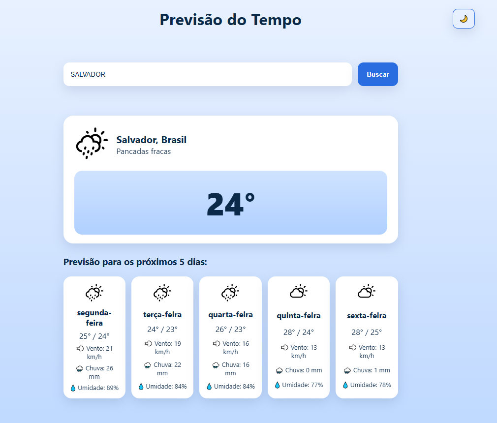
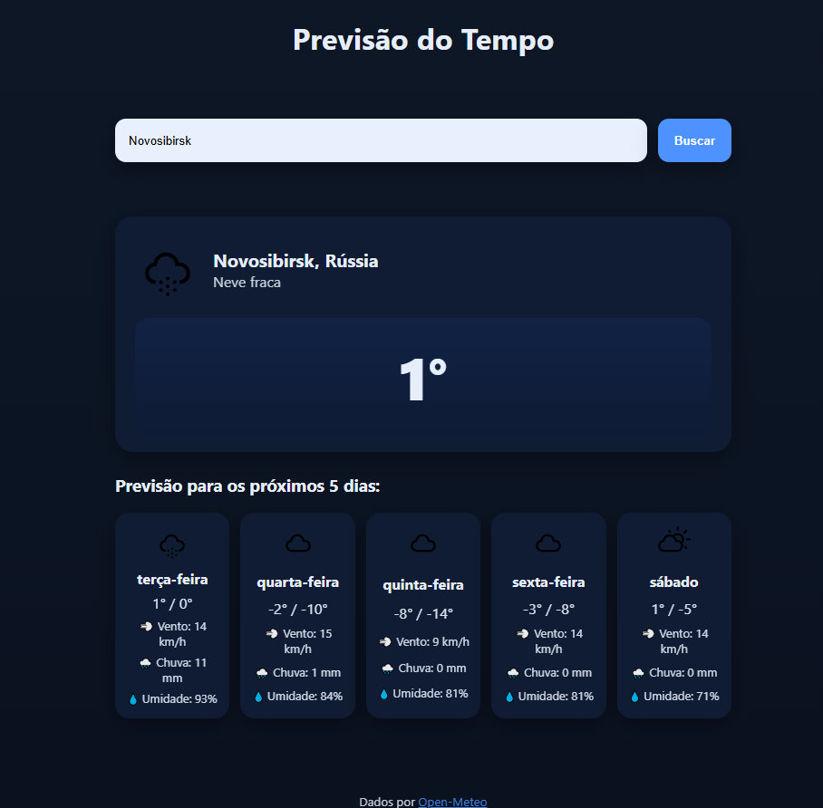

# 🌦️ Projeto Clima – Previsão do Tempo (Open Meteo)

Aplicativo web simples e responsivo para consultar **a previsão do tempo** de qualquer cidade, usando a **API Open-Meteo**.  
Desenvolvido em **JavaScript puro**, com integração de API, testes automatizados e suporte a tema claro/escuro.

---

## 🚀 Funcionalidades

- 🔍 Busca por nome da cidade (via Open-Meteo Geocoding)
- 🌡️ Mostra clima atual e previsão para os **5 próximos dias**
- 🧭 Exibe temperatura, vento, chuva e umidade média
- ☀️ Alternância entre **modo claro/escuro**
- 💬 Mensagens de erro amigáveis (ex: “Cidade não encontrada”)
- ✅ Testes unitários com **Jest + jsdom**

---

## 🧠 Tecnologias e Ferramentas

| Tecnologia / Ferramenta   | Finalidade                                     |
| ------------------------- | ---------------------------------------------- |
| JavaScript ES6+           | Lógica, integração com API, manipulação de DOM |
| HTML5 e CSS3              | Interface, responsividade e estilos            |
| Open-Meteo Geocoding API  | Conversão Nome da Cidade → Coordenadas         |
| Open-Meteo Weather API    | Dados climáticos                               |
| Jest (Node)               | Testes automatizados                           |
| Git + GitHub              | Versionamento e organização do projeto         |
| ChatGPT, Copilot e Claude | Assistência na escrita e revisão de código     |

---

## 🖥️ Interface

| Modo Claro                   | Modo Noturno          |
| ---------------------------- | --------------------- |
| *()* | ** |

---

## ⚙️ Estrutura do Projeto

projeto_clima/
├── assets/
│ └── img/ # Ícones climáticos (.svg)
├── tests/
│ ├── api.test.js # Testes da camada de API
│ └── dom.test.js # Testes de interface e DOM
├── api.js # Lógica principal e integração com API
├── index.html # Estrutura base da aplicação
├── style.css # Estilos e temas
├── jest.config.js # Configuração do Jest
├── jest.setup.js # Setup para ambiente de testes
└── package.json

---

## 🚀 Como executar o projeto

1. git clone https://github.com/carinabentlin/projeto_clima.git

2. Acesse a pasta:

cd projeto_clima

3. Abra o projeto no VS Code e execute o index.html usando Live Server.

---

## 🧪 Testes Automatizados

O projeto inclui função isolada para testes (buscarClimaPorCoordenadas).

**Rodar os testes:**
npm install
npm test

**Exemplo de teste (tests/api.test.js):**
    const { buscarClimaPorCoordenadas } = require("../api.js");

    test("Retorna dados contendo temperatura", async () => {
      const clima = await buscarClimaPorCoordenadas(-23.55, -46.63);
      expect(clima).toHaveProperty("temperature");
    });

---

## 🗃️ Estrutura de Pastas
    projeto_clima/
    │ index.html
    │ style.css
    │ api.js
    │ package.json
    │ README.md
    │
    └── tests/
        └── api.test.js

---

| Branch                   | Conteúdo                                      |
| ------------------------ | --------------------------------------------- |
| **01_projeto**           | Estrutura inicial + interface                 |
| **02_ep_codificacao**    | Refinamento, retorno formatado, tema dinâmico |
| **03_testes**            | Testes com Jest                               |
| **04_doc_review**        | Documentação, README e revisão de código      |
| **05_doc_review**        | Implementação de funcionalidades avançadas    |
| **06_etica_segurança**   | Ética e Segurança                             |

---

## 🛡️ Segurança e Licenciamento

✅ Nenhum dado sensível é armazenado.

🌍 A aplicação consome apenas dados públicos da Open-Meteo.

🔒 O código é open-source, sob licença ISC.

⚠️ Chaves de API não são necessárias (API livre de autenticação).

---

## 📄 Licença

Este projeto está licenciado sob os termos da licença ISC.
Você pode usar, copiar e modificar livremente, desde que cite a autoria original.

---

## 👩‍💻 Autoria

**Carina Bentlin**
Desenvolvedora Full Stack em formação
LinkedIn: https://www.linkedin.com/in/carinabentlin/